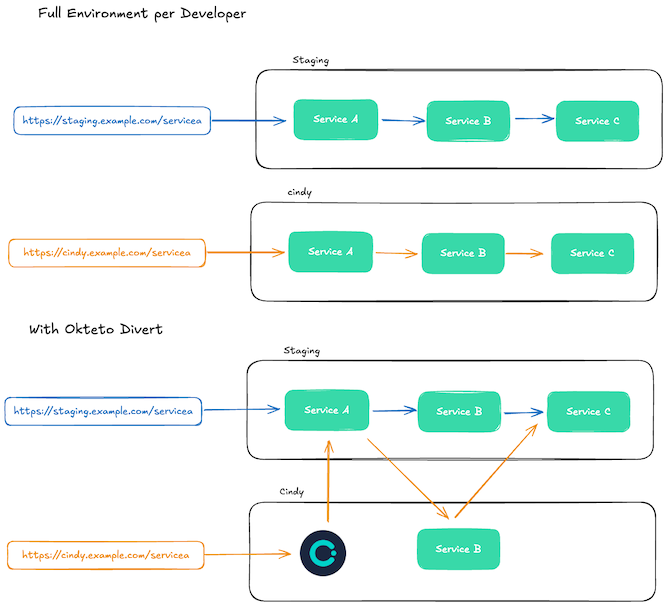

# Okteto Divert Showcase - Chain of Services via Service Discovery

Okteto Divert allows you to spin up Development Environments that include **only the services you're actively working on**, while routing all other service traffic to a **shared environment**. This dramatically reduces infrastructure cost and speeds up environment startup—especially for large microservice applications.
👉 [Learn more about Divert in our docs](https://www.okteto.com/docs/reference/okteto-manifest/#divert)

This sample shows how to you can use Divert header propagation features to programatically route requests between services that talk to each other using Kubernetes’ service discovery mechanisms/

In this example serviceA calls service B via a public ingress, and service B calls service C via the kubernetes service name.

# Try the sample

1. Clone the repository:
   ```bash
   git clone https://github.com/okteto/divert-showcase.git
   cd divert-showcase/chain-of-services-via-discovery
   ```
2. Deploy the full environment in the shared namespace:
   ```bash
   okteto deploy -n staging
   ```

3. Call the Chain of Services:
    ```bash
    curl https://servicea-staging.okteto.example.com/chain
    ```


    ```
    Service A says hello from staging!
    Service B says hello from staging!
    Service C says hello from staging!
    ```

4. Deploy a diverted environment in your personal namespace.
   ```bash
   okteto deploy -n cindy okteto.serviceb.yaml
   ```

5. Call the Chain of Services using the endpoint in your personal namespace. Notice how the output of ServiceB is coming from your personal namespace.
    ```bash
    curl https://servicea-cindy.okteto.example.com/chain
    ```


    ```
    Service A says hello from staging!
    Service B says hello from cindy!
    Service C says hello from staging!
    ```

# How does it work?

