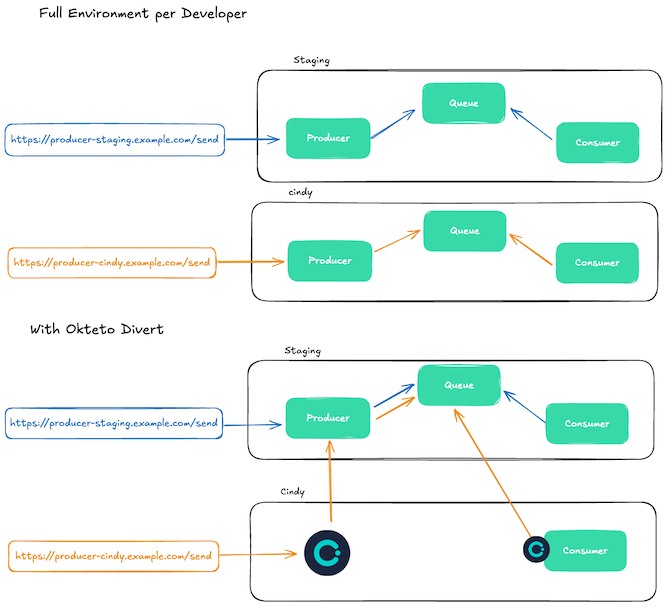

# Okteto Divert Showcase - Producer-Consumer Kafka

Okteto Divert allows you to spin up Development Environments that include **only the services you're actively working on**, while routing all other service traffic to a **shared environment**. This dramatically reduces infrastructure cost and speeds up environment startup—especially for large microservice applications.
👉 [Learn more about Divert in our docs](https://www.okteto.com/docs/reference/okteto-manifest/#divert)

This sample shows how to you can use Okteto Divert with services that interact via Kafka topics.


# Try the sample

1. Clone the repository:
   ```bash
   git clone https://github.com/okteto/divert-showcase.git
   cd divert-showcase/producer-consumer-kafka
   ```
2. Deploy the full environment in the shared namespace:
   ```bash
   okteto deploy -n staging
   ```

3. Call producer to send a message to the Kafka topic
    ```bash
    curl https://producer-staging.okteto.example.com/send
    ```


    ```
    Message sent successfully: Hello world at Thu Apr 10 2025 05:31:12 GMT+0000 (Coordinated Universal Time)
    ```

4. Deploy a diverted environment in your personal namespace.
   ```bash
   okteto deploy -n cindy okteto.divert.consumer.yaml
   ```

5. Call the producer using the endpoint in your personal namespace.

    ```bash
    curl https://producer-cindy.okteto.example.com/send
    ```


    ```
    Message sent successfully: Hello world at Thu Apr 10 2025 05:31:12 GMT+0000 (Coordinated Universal Time)
    ```

6. Notice how the consumer on staging is not consuming the message, while the consumer on your personal namespace is consuming it.

# How does it work?

